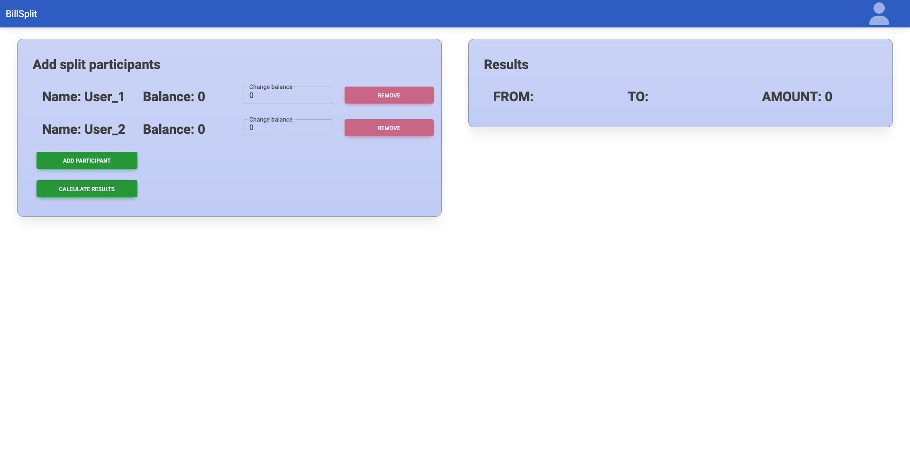
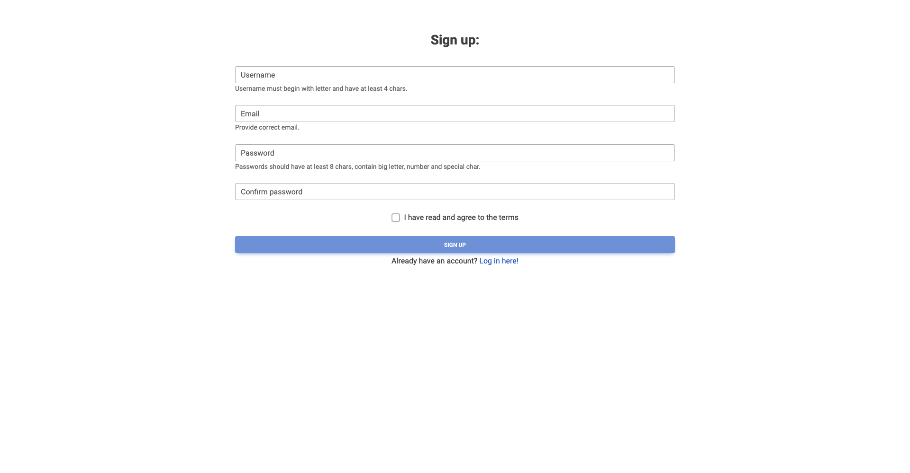
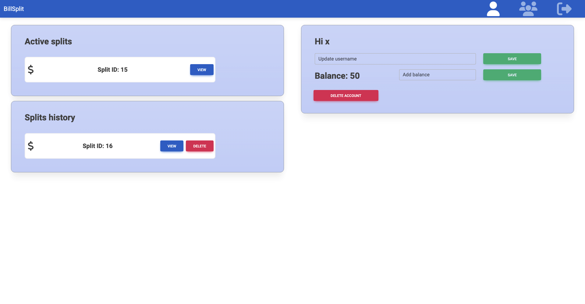
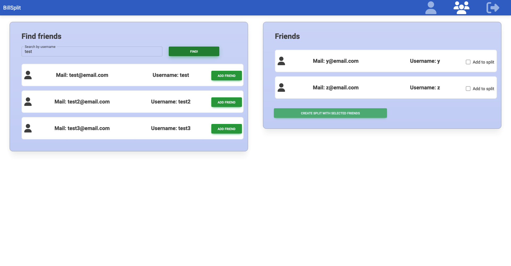
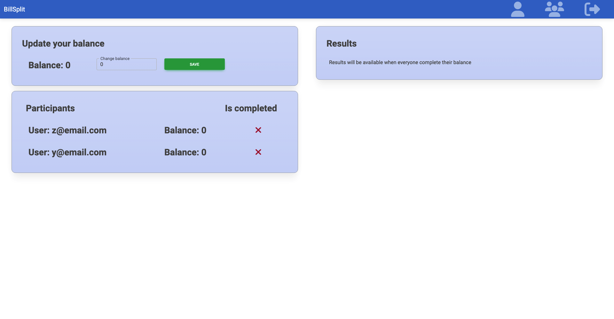

# BillSplit Web Application 

This project was created during 'Advanced technologies for developing web applications' course. It allows you to calculate how much you owe each other after spending together. And for users who set up an account, it allows you to create a split with your friends, which will be automatically settled after each of you enters the amount you put into the shared pot.

***
## Technologies used
[](https://skills.thijs.gg)
*** 

## To run application

Make sure you have installed followind dependencies:

- Docker
- Docker Compose

Then follow the instructions:

1. Clone this repository.

2. Open terminal and navigate to project's root directory.

3. To run project use command:
    ```
    docker-compose up --build
    ```
    
4. Frontend will be accessible at:
    > http://localhost:3000

5. Backend server will be accesible at:
    > http://localhost:8080

6. Swagger documentation will be accesible at:
    > http://localhost:8080/swagger-ui/index.html#/


# Preview

## Main page

***
## Sign up page

***
## Profile

***
## Friends

***
## Active split

***